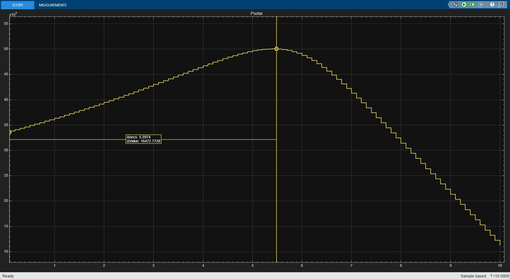
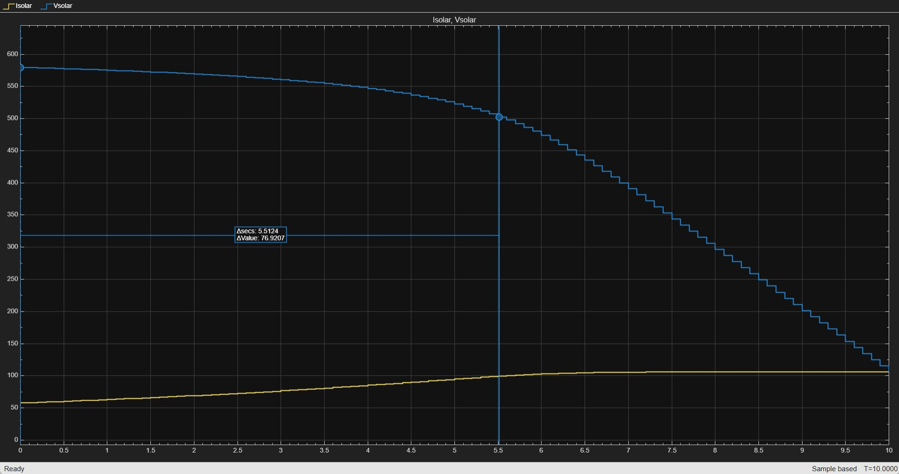
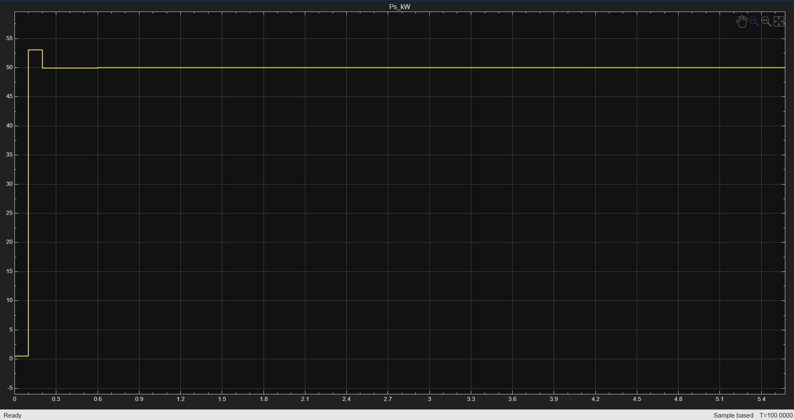
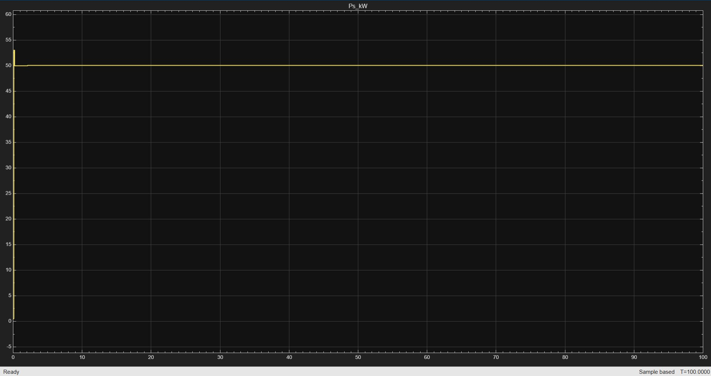
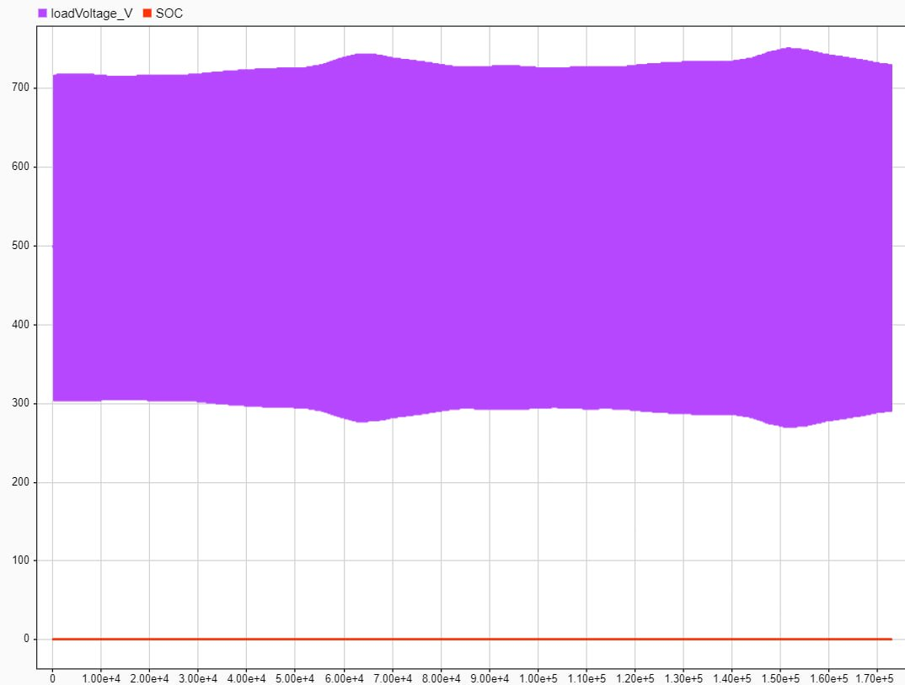
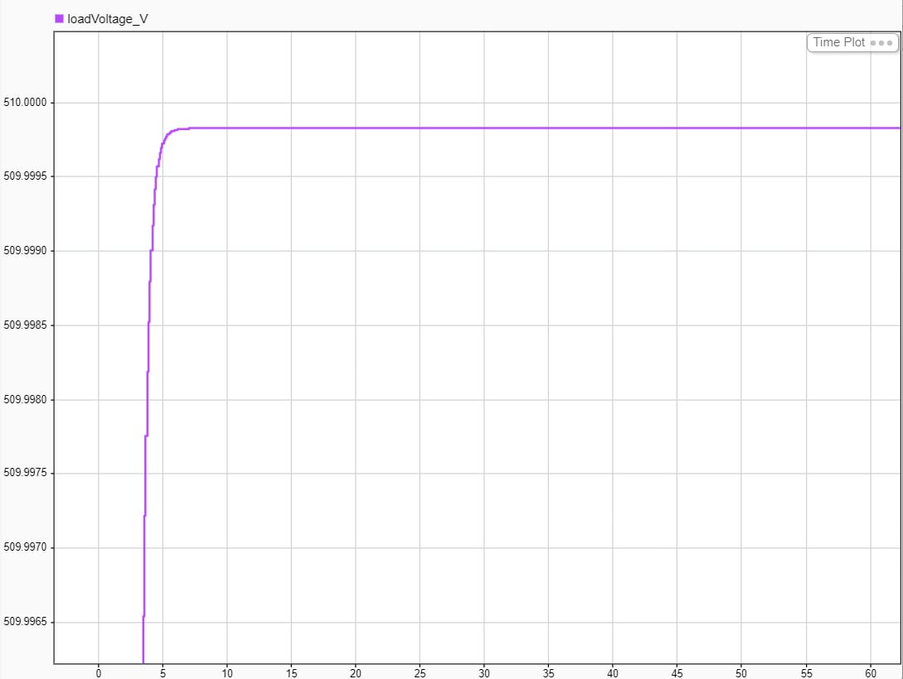
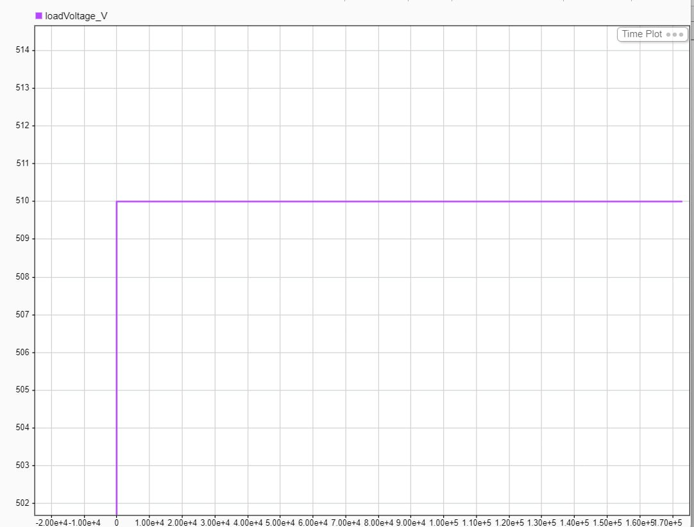

# Microgrid on Mars — Task Solutions

## Table of Contents

- [Task 1 — Design Space Exploration](#task-1--design-space-exploration)
- [Task 2 — Maximum Power Transfer (Impedance Matching)](#task-2--maximum-power-transfer-impedance-matching)
- [Task 3 — Maximum Power Point Tracking (MPPT)](#task-3--maximum-power-point-tracking-mppt)
- [Task 4 — Battery Voltage Control](#task-4--battery-voltage-control)

---

## Task 1 — Design Space Exploration

### Goal

Identify the **minimum solar power rating** and **initial battery SOC** that keep the station powered for the full **7-sol** mission.

### Approach

We varied **Solar Power Rating** in 10 kW steps and **Initial Battery SOC** in 10% steps, then ran the simulation to check whether power was sustained for 7 sols. We tracked the data for each try.

### Parameter Sweep Results

| # | Solar kW | Initial SOC (%) | Pass/Fail |
|---|----------|-----------------|-----------|
| 1 | 30       | 40              | **Fail**  |
| 2 | 40       | 40              | **Fail**  |
| 3 | 50       | 40              | **Fail**  |
| 4 | 60       | 40              | **Fail**  |
| 5 | 50       | 50              | **Fail**  |
| 6 | 40       | 60              | **Fail**  |
| 7 | 50       | 80              | **Fail**  |
| 8 | 60       | 80              | **PASS**  |
| 9 | 50       | 90              | **PASS**  |

### Selected Design

Two viable configurations were found: **60 kW / 80% SOC** and **50 kW / 90% SOC**.

We chose **50 kW / 90% SOC** because it uses the lower solar power rating, which is the key criterion in identifying the minimum viable configuration.

---

## Task 2 — Maximum Power Transfer (Impedance Matching)

### Solar Array Configuration

#### Number of Series Cells ($N_s$)

Connecting cells in series means linking the positive terminal of one cell to the negative terminal of the next.

- **The Physics:** In a series connection, the voltage adds up, while the current flowing through the entire string remains equal to the current of a single cell.
- **The Purpose:** This parameter dictates the **operating voltage** of the system. If a single cell operates at roughly 0.5 V, stringing 1,000 cells together in series builds the necessary electrical pressure to meet a high-voltage target, such as a **500 V DC bus**. On an I‑V curve, increasing $N_s$ stretches the graph **horizontally** to the right, extending the open-circuit voltage ($V_{oc}$).

#### Number of Parallel Strings ($N_p$)

Once a string of cells achieves the desired voltage, multiple identical strings are connected in parallel — all positive ends together, all negative ends together.

- **The Physics:** In a parallel connection, the current adds up, while the voltage remains the same as that of a single string.
- **The Purpose:** This parameter scales the **total power capacity**. Because power is the product of voltage and current ($P = V \cdot I$), and the voltage is already fixed by the series connection, adding more strings in parallel multiplies the total current. This allows the array to hit a specific power output target, like **50 kW**. On an I‑V curve, increasing $N_p$ stretches the graph **vertically** upwards, raising the short-circuit current ($I_{sc}$).

### Simulation Results

A variable resistor was swept from high to low impedance to find the maximum power point.

**Variable Resistor Parameters:** Initial Value = 10 Ω, Slope = −0.9 Ω/s, Initial Time = 0 s

#### Solar Power ($P_{solar}$) vs. Time

The power curve rises as resistance decreases, peaks at approximately **50 kW** near $t \approx 5.5\,\text{s}$, and then falls as the impedance mismatch grows in the opposite direction.

#### Solar Current ($I_{solar}$) and Voltage ($V_{solar}$) vs. Time

At the maximum power point ($t \approx 5.5\,\text{s}$), the operating conditions are approximately $V_{solar} \approx 500\,\text{V}$ and $I_{solar} \approx 100\,\text{A}$, confirming the $P = V \cdot I = 50\,\text{kW}$ target.

### Optimal Load Resistance

At $t = 5.5\,\text{s}$, the resistance value is:

$$R_{opt} = 10 - 0.9 \times 5.5 = 5.05\,\Omega$$

This is the impedance that maximizes power transfer from the solar array to the load.

---

## Task 3 — Maximum Power Point Tracking (MPPT)

### Controller Parameters

| Parameter | Symbol | Value | Rationale |
|---|---|---|---|
| Initial Duty Cycle | $D_{init}$ | 0.5 | Sets the starting operating point where $V_{in} \approx V_{out} \cdot (1 - D) = 250\,\text{V}$, providing a balanced, neutral start that drastically reduces the initial transient and minimizes large inrush currents during startup. |
| Upper Duty Cycle Limit | $D_{max}$ | 0.80 | Critical **hardware protection** limit. While the ideal Boost equation suggests infinite gain as $D \to 1$, real-world parasitics (inductor winding resistance, MOSFET $R_{ds(on)}$) cause efficiency to collapse at extreme duty cycles. Capping $D$ prevents massive $I^2R$ thermal losses, extreme current spikes, and the mathematical singularity of a continuous short-circuit to ground. |
| Lower Duty Cycle Limit | $D_{min}$ | 0.20 | Ensures the converter maintains sufficient **control margin** and stays within designed Continuous Conduction Mode (CCM) boundaries, preserving regulation authority even under rapid load variations or sudden irradiance changes. |
| Perturbation Step Size | $\Delta D$ | 0.0001 | Optimal trade-off between **tracking speed** and **steady-state stability** — large enough to dynamically track the MPP during environmental shifts, yet fine enough to minimize steady-state power oscillations (ripple). |

### Simulation Results

#### MPPT Transient Response (Zoomed)

The controller converges to the **50 kW** maximum power point within approximately **0.3 s**. A brief overshoot to ~53 kW is visible before the Perturb & Observe algorithm locks onto the MPP.

#### MPPT Steady-State Performance (Full Simulation)

Over the entire 100 s simulation, the output power remains **rock-steady at 50 kW** with negligible ripple, confirming the $\Delta D = 0.0001$ step size delivers clean, flat power to the DC bus without overstressing downstream filtering components.

---

## Task 4 — Battery Voltage Control

### Objective

Regulate the DC bus load voltage within the **500–520 V** range.

### Design Choices

| Parameter | Value | Rationale |
|---|---|---|
| Voltage Set Point | **510 V** | Centered within the 500–520 V band, providing equal margin on both sides. |
| Sample Time ($T_s$) | **0.1 s** | 10 control cycles per second — sufficient bandwidth for this application. |
| PI Gain ($K$) | **0.005** | Tuned to minimize oscillations while maintaining adequate response speed. |

### Tuning Process

#### Attempt 1 — $K = 0.01$ (Too Aggressive)

With $K = 0.01$, the controller exhibited **large voltage oscillations**, swinging well outside the acceptable 500–520 V band. The gain was too aggressive for the system dynamics.

#### Final Result — $K = 0.005$

Halving the gain to $K = 0.005$ eliminated the oscillations while preserving fast settling.

##### Transient Response (Zoomed)

The voltage settles to exactly **510 V** with only minimal oscillation at startup (~0.004 V undershoot), recovering within a few seconds.

##### Full Simulation

Over the full simulation window, the load voltage holds a **flat 510 V** — well within the 500–520 V requirement.

The parameters we selected allow the load to maintain a voltage between **500 V** and **520 V** for **7 sols**. As shown in the graph, the voltage remains at **510 V** throughout the simulation. The SoC (State of Charge) stays a few percentage points above zero, indicating that the parameter sizing for the solar array, including the initial SoC and Solar Power Rating, is accurate for the mission duration and avoids energy waste.
